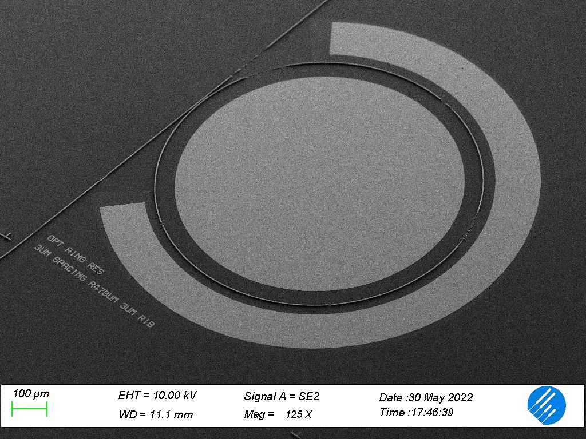

# Lab Experience
Lab experience: the microfabrication process of electro-optical devices, while attempting to achieve high doping level in a silicon substrate
---
This repo contains the material used during the lab experience @ PoliMi-Polifab lab in may 2022.

Silicon doping is a fundamental part of many microfabrication processes. In the telecommunication world, for example, electro-optical modulators depend on the possibility of doping the material that composes them, forming the junction that enables their function. For these reasons it is extremely useful to be able to master in-house doping processes. During this Lab Experience at Polifab, the feasibility
of this process has been proven using dopant sources developed in the laboratory itself, maintaining cost effectiveness, low toxicity, and simplicity as requirements. For these reasons, inorganic acids such as boric acid and phosphoric acid have been used as dopant sources, initially in conjunction with easily available low toxicity solvents, then in a silicon oxide sol gel formulation. The methods used were spin
coating and thermal diffusion doping due to their simplicity, an essential factor for a good replicability of what was obtained.
This activity also offered the precious opportunity to follow the development process of microelectronic and electro-optical devices at a didactic level, starting from the CAD drawing and reaching the end of the physical realization process. Optical ring modulators, diodes of various sizes, a resistor and N-mosfet transistor have been made. The didactic aspect of the process was privileged with respect to the design
according to the state of the art.

